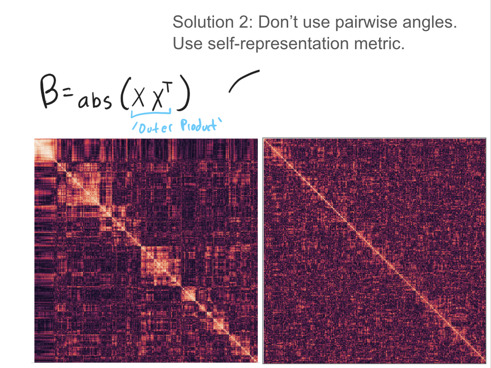

# Subspace Sifting: Detecting Structure and Intersections in PCT Training

This document describes the **subspace sifting** algorithm used to make split-or-extend decisions during Principal Component Tree (PCT) construction. It supersedes the legacy angle-based hypothesis testing approach described in the original PCT paper.

## 1. Introduction and Motivation

During top-down PCT construction, each node faces a fundamental question: should the tree **extend** (add a single child capturing the next principal direction) or **split** (branch into multiple children for distinct subspace clusters)?

The original PCT paper used a hypothesis test on pairwise angle distributions. If angles between projected data points deviated significantly from the uniform distribution expected under a single Gaussian subspace, clustering was detected. This approach had two critical flaws.

**The Over-Whitening Problem.** The legacy method whitened the data before computing angles, intending to reveal "true" angular structure independent of variance. However, whitening small samples (common deep in the tree) often destroyed the very structure we sought to detect. Random sampling noise got amplified, creating spurious patterns or masking real ones.

**The N-Squared Problem.** Pairwise angle comparisons produce N² measurements. With thousands of data points, even tiny deviations from uniformity yield astronomically small p-values. A p-value of 10⁻⁵⁰ tells us nothing useful—it just means we have lots of data. The test became meaningless for real-world dataset sizes.

Subspace sifting addresses both problems through two key shifts:

1. **From angle distribution to self-representation.** Instead of asking "are angles uniformly distributed?", we ask "can points represent each other well?" Clustered data exhibits self-similarity within clusters; uniform data does not.

2. **From p-values to effect sizes.** Instead of asking "is there *any* detectable structure?", we ask "is the structure *large enough* to matter?" Cohen's d provides this—a standardized measure of the magnitude of difference between observed and null distributions.

## 2. Core Concept: Self-Representation as Structure

The central insight is that clustered data looks different from uniform data when viewed through the lens of self-representation.

Consider the outer product matrix **B = |X Xᵀ|**, where X is (soft) unit-normalized data. Each entry B[i,j] measures how well point j's direction aligns with point i. For clustered data, points within the same cluster align well with each other, producing bright blocks along the diagonal when rows are sorted by cluster membership. For uniform (Gaussian) data, the matrix appears relatively homogeneous.



The left heatmap shows clear block-diagonal structure—clusters of points that represent each other well. The right heatmap shows a matched Gaussian null distribution with no such structure. Subspace sifting quantifies this difference.

## 3. The Structure Index

To convert the outer product matrix into a per-point measurement of "how much structure surrounds this point," we compute a **structure index**.

### Soft Unit Normalization

Before computing outer products, we apply a soft normalization that mostly projects points to the unit sphere while preserving some radial information:

```python
def soft_unit_normalize(X, unit_normalize_factor=4):
    X_norm = LA.norm(X, axis=1)
    median_norm = np.median(X_norm)
    relative_norm = X_norm / median_norm

    # Points near origin get down-weighted
    softening = 1 - np.exp(-unit_normalize_factor * relative_norm)

    X_unit = X / X_norm[:, np.newaxis]
    return X_unit * softening[:, np.newaxis]
```

Why not just unit normalize? Points near the origin are already well-approximated—they're close to the mean. Remember that deep in the tree, we're working with residuals. A point with small residual norm has already been captured by ancestor nodes; it shouldn't dominate our assessment of remaining structure. The soft normalization down-weights these points gracefully.

### Computing the Structure Index

Given the outer product matrix, we compute a softmax-weighted sum for each row:

```python
def subspace_structure_index(X_outer, theta=3):
    weights = softmax(X_outer, axis=1, theta=theta)
    structure_index = (weights * X_outer).sum(axis=1)
    return structure_index
```

Each point gets a scalar: high values mean "many similar neighbors exist" (clustered), low values mean "neighbors are roughly equidistant" (uniform).

**Why softmax over hardmax?** Two reasons:

1. **The duplicate point problem.** If data contains exact duplicates (common after quantization or data augmentation), hardmax would give every duplicated point a perfect score, even in otherwise uniform data.

2. **Sensitivity to comparison count.** With hardmax, the best match improves as you add more comparison points, even under uniformity. Softmax with temperature θ=3 smooths this dependency.

## 4. Comparing to Null: The Matched Gaussian

To determine if observed structure is meaningful, we compare against a null distribution: what would structure index look like if the data were actually Gaussian?

The `generate_matching_gaussian` function creates synthetic data matching:
- The observed mean
- The observed covariance structure
- The observed radial distribution (distances from mean)

This third condition is subtle but important—it ensures we're not detecting "structure" that's merely an artifact of non-Gaussian radial distributions.

With both observed and null structure indices in hand, we apply a two-pronged test:

```python
def test_with_effectsize(values, null_values, alpha, effect_threshold):
    pval = ttest_ind(values, null_values, alternative="greater").pvalue
    effect = cohend(values, null_values)
    significant = (pval <= alpha) and (effect >= effect_threshold)
    return significant, pval, effect
```

Both conditions must hold: the difference must be statistically significant (p < α) AND practically meaningful (Cohen's d > threshold). The effect size threshold (typically 0.2, a "small" effect) filters out detectable-but-trivial structure.

## 5. The Sifting Process: Finding Intersections

Detecting clustering is only half the problem. We also need to identify **intersection dimensions**—leading principal directions shared across clusters before they diverge.

Imagine a "sliding window" over the principal components. We start with dimensions 0 through k (where k is half the rank), compute structure index, then slide the window: dimensions 1 through k+1, then 2 through k+2, and so on. At each position, we're asking: "if we ignore the leading dimensions, does clustering structure still appear?"

```python
for sift_depth in range(1, max_depth):
    # Window slides: [sift_depth : sift_depth + half_dim]
    deeper_norm = soft_unit_normalize(U[:, sift_depth:sift_depth+half_dim])
    u_outer_deep = compute_outer_product(deeper_norm)
    deep_structure_index = subspace_structure_index(u_outer_deep)

    # How much structure did we lose by removing leading dimensions?
    reduction = base_structure_index - deep_structure_index
    reduction_effect = reduction.mean() / reduction.std()
```

**Why a fixed window size?** Angles become more orthogonal in higher dimensions (a consequence of concentration of measure). If we compared structure index across different-sized windows, we'd conflate geometric dimension effects with actual structure changes. The fixed window provides an apples-to-apples comparison.

### Stopping Conditions

The sifting loop terminates when either:

1. **Effect size exceeds threshold.** The reduction in structure from removing dimension k is large enough (`reduction_effect > sifting_effect_size`). This means dimensions 0..k-1 are shared across clusters—removing them destroys the cluster structure.

2. **Effect size decreased from previous iteration.** Even if we haven't crossed the threshold, if the effect size peaked and started declining, we've likely found the best split point. This is analogous to early stopping in neural network training—we recognize we may have gone too far and a previous result was better.

The sift depth at termination becomes `intersecting_dimensions`: the number of principal directions that should be captured before splitting.

## 6. The Fuse Mechanism: Capturing Intersections Before Splitting

When sifting detects both clustering AND a nonzero intersection dimension count, the tree shouldn't split immediately. It needs to first capture the shared subspace.

This is implemented via a "fuse" mechanism in the training loop. When `intersecting_dimensions > 0`, the training node sets `compr_test_fuse` to that value. On subsequent expansions:

1. If the fuse is positive, the node **extends** (adds a single child) and decrements the fuse
2. When the fuse reaches zero, the node **splits** via subspace clustering

Each extension captures one shared principal direction. Only after all shared directions are captured does the tree actually branch. This ensures the intersection subspace is represented in the tree structure before the branches diverge—critical for the PCT's ability to model intersecting subspaces efficiently.

## 7. A Note on What We Don't Do: Whitening

The legacy approach whitened data before angular analysis, attempting to reveal "intrinsic" angular structure independent of variance. Subspace sifting deliberately avoids whitening.

This has a consequence: even if there's no geometric intersection in the whitened space, if the leading principal direction has very high variance, the structure index might not show dramatic reduction when we remove it. The sifting process may wait until a deeper window to split.

In practice, this is often desirable. A direction with enormous variance is capturing something important about the data—perhaps it deserves to be shared across branches even if, geometrically, the clusters could be separated immediately. The algorithm lets variance speak alongside geometry.

## 8. Practical Considerations: Sampling and Chunking

Computing N² outer products for every sifting test would be prohibitively expensive, especially since sifting runs potentially hundreds of times during PCT construction.

### The n_comparisons Hyperparameter

The structure index depends on how many points we compare each point against. To decouple this from dataset size and ensure consistent behavior, we fix `n_comparisons` (typically 500). Each point is compared against exactly this many others.

### The Chunking Mechanism

The ideal approach: for each of the N points, randomly sample `n_comparisons` other points independently. This maximizes statistical independence between rows.

The problem: this requires continuous random sampling without replacement and scattered memory access—slow in practice.

The solution: chunk the data. Split N points into `n_chunks` groups of `n_comparisons` each. Within each chunk, compute the full outer product. The result is an (n_chunks × n_comparisons) × n_comparisons matrix.

```python
for ci in range(n_chunks):
    X_chunk = X[chunk_masks[ci]]
    outer_chunk = np.square(X_chunk @ X_chunk.T)
    result[chunk_start:chunk_end] = outer_chunk
```

This sacrifices some statistical independence (points within a chunk are compared against the same set) but dramatically improves runtime. The chunked approach processes the same number of dot products using efficient matrix operations rather than scattered sampling.

### Sampling for Deep Nodes

Deep in the tree, when working with smaller data subsets but calling sifting frequently, we also sample data points (`sifting_samples` parameter) rather than using all available data. This keeps runtime bounded as the tree grows.

### Key Hyperparameters

| Parameter | Typical Value | Purpose |
|-----------|---------------|---------|
| `sifting_effect_size` | 0.2–0.8 | Threshold for intersection detection; most important parameter |
| `test_pval` | 0.001 | P-value threshold for initial clustering detection |
| `test_effect_size` | 0.2 | Cohen's d threshold for clustering detection |
| `n_comparisons` | 500 | Points per comparison; controls structure index consistency |
| `n_chunks` | 8 | Chunks for outer product computation |

## 9. Summary

Subspace sifting replaces angle-based hypothesis testing with a self-representation framework:

1. **Structure index** measures how well each point can be represented by its neighbors
2. **Comparison to matched Gaussian null** determines if structure is meaningful
3. **Effect size (Cohen's d)** replaces p-values as the primary decision metric
4. **Sliding window sifting** identifies shared intersection dimensions
5. **The fuse mechanism** ensures intersections are captured before splitting

This approach avoids the pathologies of the legacy method—over-whitening and meaningless p-values—while providing a principled way to detect both clustering and intersection structure during PCT construction.
