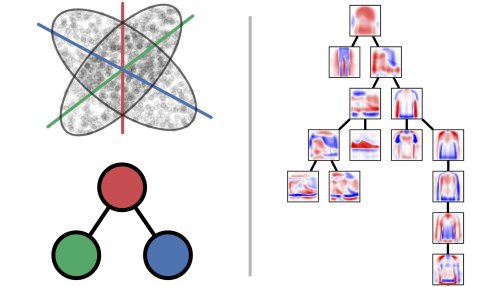

# PCTree: Principal Component Trees and their Persistent Homology

[](https://opensource.org/licenses/MIT)
[](https://www.python.org/downloads/)

PCTree is a Python library that implements Principal Component Trees - a novel method for learning and representing hierarchical subspace structures in high-dimensional data. This approach generalizes both PCA and subspace clustering methods into a unified framework.

## Overview

Principal Component Trees (PCT) build on the union of subspaces model but extend beyond the disjoint subspace assumption of traditional clustering methods. A PCT represents:

- A hierarchical graph structure of principal components
- Each node corresponds to a principal component (vector + singular value)
- Each branch of the tree defines a subspace containing part of the data
- Intersecting subspaces are represented by shared nodes in the tree



## Installation

```bash
pip install pctree
```

### Dependencies
- numpy
- scipy
- scikit-learn

## Quick Start

See also: **demo_start_here.ipynb**

```python
import numpy as np
from pct.training import PCTreeTrainer, PCTreeTrainerOptions
from pct.branches import EfficientEncodingRouter
from pct.core import PCTreeCoefficients

# Load your data
X = np.load("your_data.npy")
X_mean = X.mean(axis=0)
X = X - X_mean  # Center the data

# Create and fit a PCT
trainer = PCTreeTrainer(PCTreeTrainerOptions(
    max_nodes=50,     # Maximum tree size 
    max_children=5,   # Maximum children per node
    max_width=10,     # Maximum width of the tree
    sifting_effect_size=0.6  # Controls cluster detection sensitivity
))

# Fit the tree using a two-phase approach
trainer.fit_partition(X, verbose=1)  # First phase: top-down partitioning
tree = trainer.fit_em(X, X_topdown=X, verbose=0)  # Second phase: expectation-maximization

# Assign data to branches
router = EfficientEncodingRouter(tree)
branch_assignments = router.predict(X)

# Encode data using the tree
coeffs = PCTreeCoefficients(tree, X, branch_assignments)

# Reconstruct the data
X_reconstructed = coeffs.reconstruct()

# Calculate reconstruction quality
variance_captured = 1 - (((X - X_reconstructed)**2).sum() / (X**2).sum())
print(f"Variance captured: {variance_captured:.4f}")
print(f"Average encoding size: {coeffs.average_scalars_used():.2f} scalars per data point")

# Save the tree and encodings for later use
coeffs.save("data_encoded.npz")
```

## Features

- **Efficient Data Representation**: PCTree often encodes data more efficiently than PCA
- **Hierarchical Structure Discovery**: Automatically detects and represents hierarchical subspace structures
- **Topological Analysis**: Applies persistent homology tools to analyze tree structure
- **Visualization Tools**: Built-in plotting functions to explore tree structure and data encodings
- **IO Utilities**: Save and load trees and encodings for later use
- **Built-In Applications:** Missing Data Imputation, Data Generation

## Demos

The repository includes several Jupyter notebooks demonstrating key capabilities:

1. **demo_start_here.ipynb** The basics of how to train and visualize PCTrees
2. **demo_compression.ipynb**: Data compression using PCTree vs. PCA
3. **demo_generative.ipynb**: Generating new data samples from learned PCTree structure
4. **demo_impute.ipynb**: Missing data imputation using PCTree
5. **demo_persistent_homology.ipynb** Using Persistent Homology to describe the shape of PCTrees.

## Citation

If you use PCTree in your research, please cite:

```bibtex
@inproceedings{kizaric2024principle,
  title={Principle component trees and their persistent homology},
  author={Kizaric, Ben and Pimentel-Alarc{\'o}n, Daniel},
  booktitle={Proceedings of the AAAI Conference on Artificial Intelligence},
  volume={38},
  number={12},
  pages={13220--13229},
  year={2024}
}
```

## Contact

- Ben Kizaric (benkizaric@gmail.com)
- Daniel Pimentel-Alarcón (pimentelalar@wisc.edu)

## License

This project is licensed under the MIT License - see the LICENSE file for details.

---

## Development Setup

This section is for contributors and developers who want to modify or extend pctree.

### Prerequisites

- Python 3.11 or higher
- Git

### Option 1: Using uv (Recommended - Fast!)

[uv](https://github.com/astral-sh/uv) is a blazingly fast Python package manager. This is the recommended approach for active development.

```bash
# Install uv if you don't have it
curl -LsSf https://astral.sh/uv/install.sh | sh
# or: pip install uv

# Clone the repository
git clone https://github.com/benkizaric/pctree.git
cd pctree

# Create environment and install dependencies (one command!)
uv sync --extra dev

# Activate the virtual environment
source .venv/bin/activate  # On Windows: .venv\Scripts\activate
```

### Option 2: Using pip + venv (Traditional)

```bash
# Clone the repository
git clone https://github.com/benkizaric/pctree.git
cd pctree

# Create virtual environment
python -m venv venv
source venv/bin/activate  # On Windows: venv\Scripts\activate

# Install package in editable mode with dev dependencies
pip install -e ".[dev]"
```

### Running Tests

```bash
# Run all tests
pytest

# Run with coverage report
pytest --cov=pctree --cov-report=html

# Run specific test file
pytest tests/test_smoke.py -v
```

### Working with Jupyter Notebooks

The demos are Jupyter notebooks. After installing dev dependencies, you can:

```bash
# Start JupyterLab
jupyter lab

# Or use VS Code
# Just open a .ipynb file and select the Python interpreter from your virtual environment
```

**Important for VS Code users**: Make sure to select the correct kernel (the Python interpreter from your `.venv` or `venv` directory) when opening notebooks.

### Code Quality

This project uses `black` for code formatting and `ruff` for linting:

```bash
# Format code
black src/ tests/

# Lint code
ruff check src/ tests/

# Auto-fix linting issues
ruff check --fix src/ tests/
```

### Publishing to PyPI

For maintainers with PyPI credentials:

```bash
# Clean previous builds
rm -rf dist/ build/ *.egg-info

# Build distribution packages
python -m build

# Check the build
twine check dist/*

# Upload to TestPyPI (optional - for testing)
twine upload --repository testpypi dist/*

# Upload to PyPI
twine upload dist/*
```

**Note**: Update the version number in `pyproject.toml` before publishing a new release.

### Project Structure

```
pctree/
├── src/pctree/           # Main package source code
│   ├── core.py           # PCTree data structures
│   ├── training.py       # Training algorithms
│   ├── branches.py       # Branch assignment
│   ├── io.py             # Save/load utilities
│   └── ...
├── tests/                # Test suite
│   ├── test_smoke.py     # Basic functionality tests
│   └── ...
├── demos/                # Jupyter notebook demos
├── data/                 # Example datasets
├── pyproject.toml        # Project configuration and dependencies
└── README.md             # This file
```

### Contributing

Contributions are welcome! Please:

1. Fork the repository
2. Create a feature branch (`git checkout -b feature/amazing-feature`)
3. Make your changes
4. Run tests to ensure everything works (`pytest`)
5. Format your code (`black src/ tests/`)
6. Commit your changes (`git commit -m 'Add amazing feature'`)
7. Push to your branch (`git push origin feature/amazing-feature`)
8. Open a Pull Request
